# 🛒 Projet E-commerce-PHP


## 🚀 Fonctionnalités

### 🔐 1. Enregistrement et Connexion

- Un système de register avec username / email / password pour ce connecter et garder une authenticité unique grâce à l’email.

  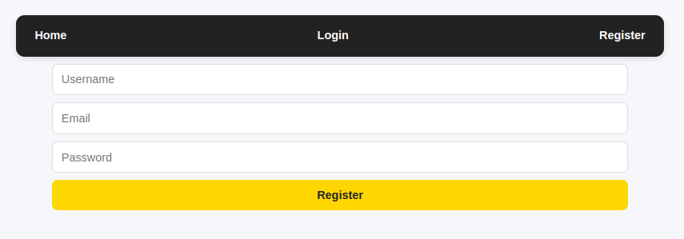
  
- Un système de login / password est aussi mise en place avec un affichage différent en fonction de si on est user / user non enregistré / admin.

  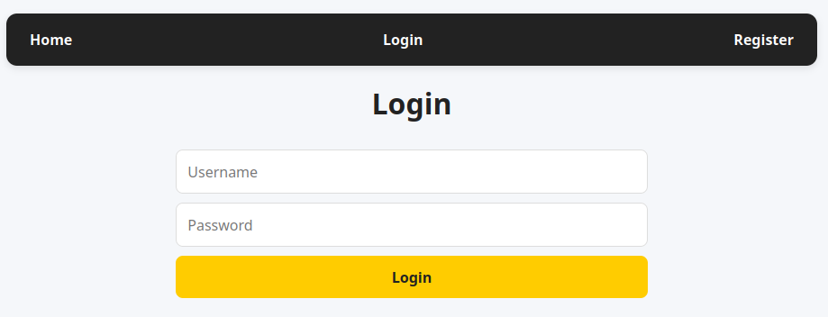

### 👤 2. Comptes Utilisateurs

- Possibilité de consulter les comptes des autres utilisateurs pour voir leurs ventes ou bien encore leur email pour les contacter en cas de problème.

  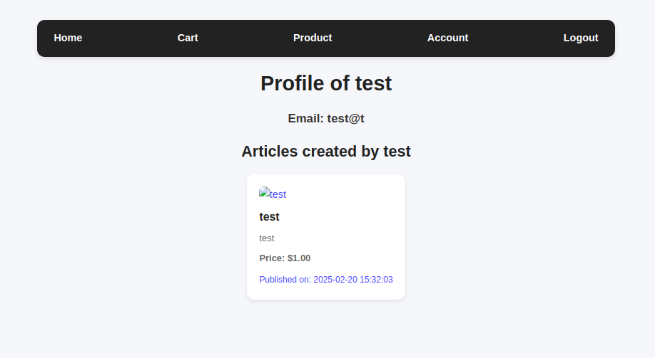
  
- Les utilisateurs peuvent modifier leurs profils (changer le mot de passe ou l'adresse e-mail) de sorte à vite régler des problèmes de sécurité de leurs point de vue.

  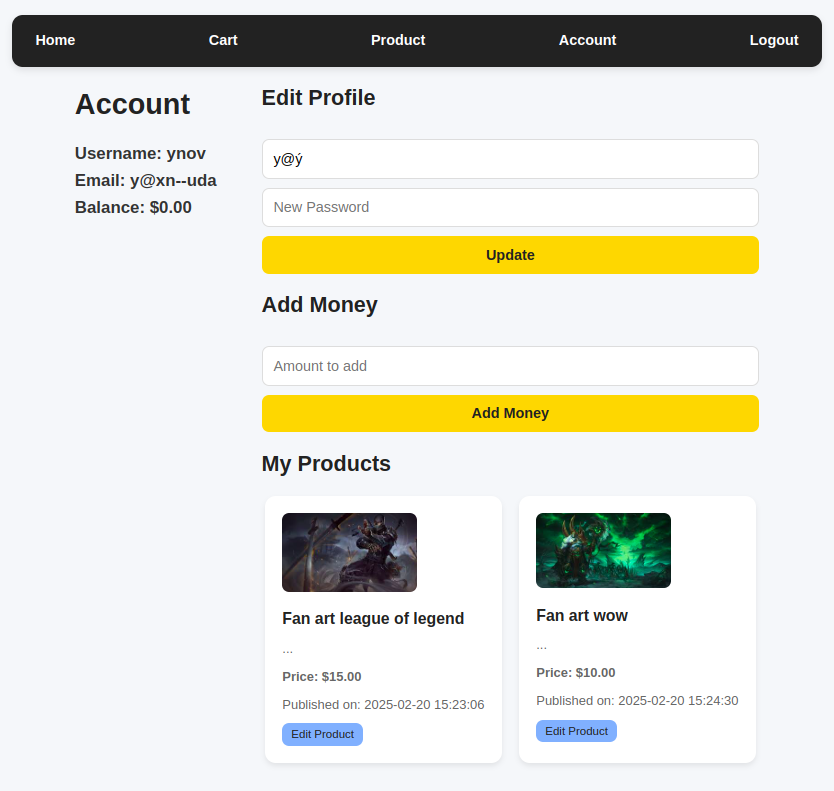

### ✏️ 3. Édition des Publications

- Les utilisateurs peuvent éditer leurs publications pour corriger des erreurs de frappe ou des problèmes d'URL d'image ce qui rend l’erreur de poste plus acceptable.

  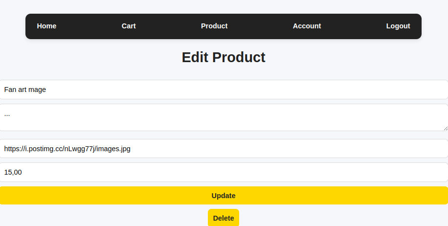
  
- L'administrateur peut aussi modifier les posts de tous les utilisateurs pour facilité la tâche à ceux qui auraient du mal avec l’informatique.

  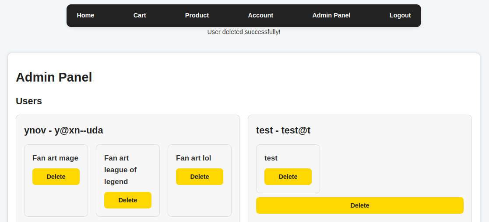

### 🔧 4. Rôle de l'Administrateur

- L'administrateur peut créer et modifier des posts utilisateurs pour éviter les débordement d’annonce ou bien d’insulte dans les postes.

  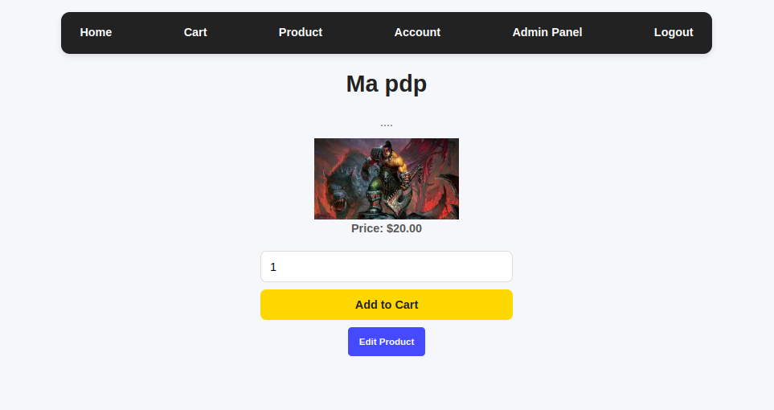
  
- L'administrateur ne voit pas les informations sensibles des utilisateurs (ex : montant d'argent) ce qui permet une certain sécurité et climat de confiance.

  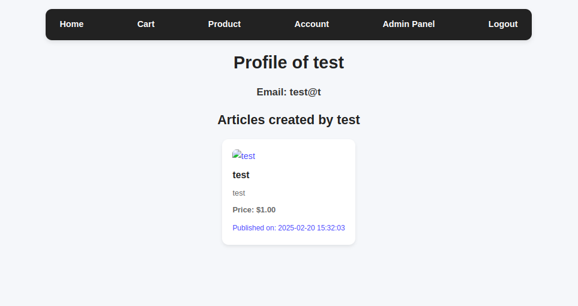

### 🛍️ 5. Système d'Achat

- Les utilisateurs peuvent acheter des articles en quantité avec un système pour éviter d’acheter des objets qui sont au dessus de son montant total d’argent sans dépasser le stock prévue.

  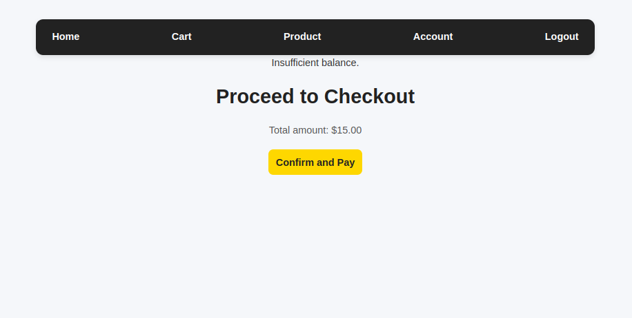
  
- Un panier est disponible pour sauvegarder les achats potentiels pour éviter des oublies ou bien de revenir en arrière si besoin.

  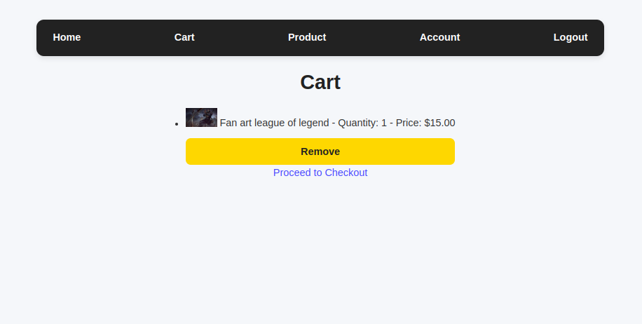

## 🏗️ Technologies utilisées

- **Backend** : (php)
- **Base de données** : (php mysql avec phpmyadmin)
- **Frontend** : (html(dans le php) / css)

## 📜 Installation

1. Clonez ce dépôt :
   ```sh
   git clone https://github.com/Altrevis/E-commerce-PHP.git
   ```
2. Ligne à modifier dans /includes/db.php :
   ```sh
   $host = 'localhost';
    $dbname = 'php_exam';
    $username = 'xxxx';
    $password = 'xxxx';
   ```
3. installer la db :

    - Créer la db avec le nom ci-dessous

    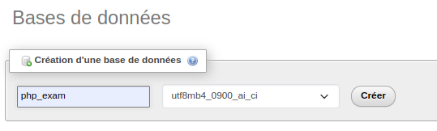

    - Ajouter la db dans l'emplacement importer

    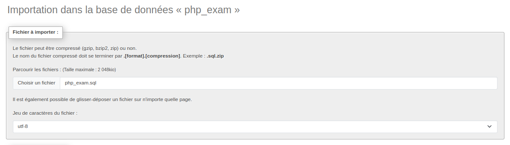
